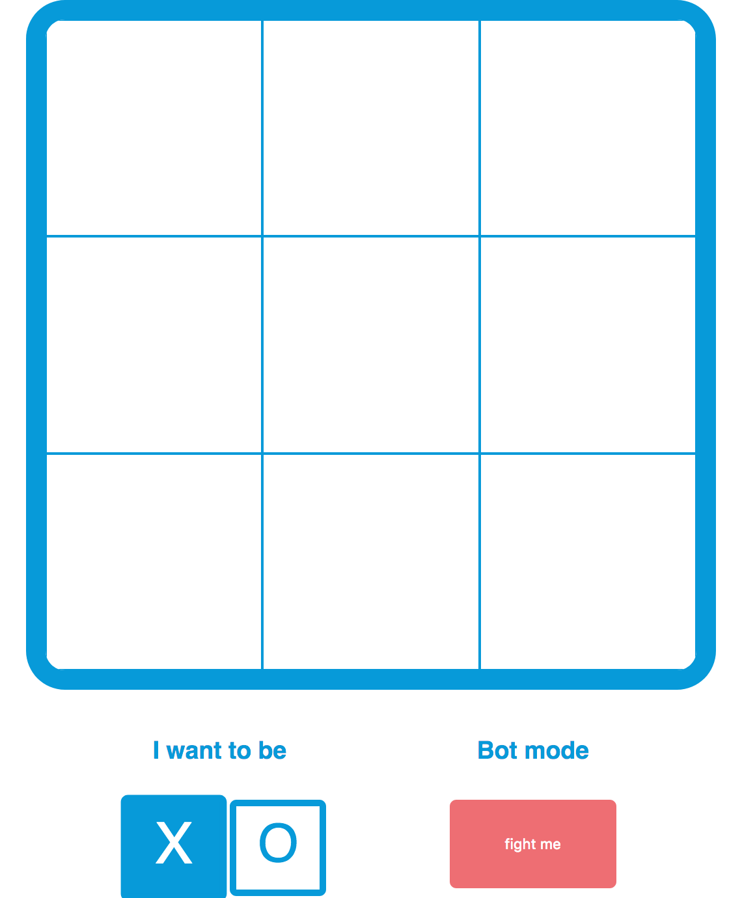

# tictactoe-minimax-algorithm

### A tic tac toe game with bot that simply can't lose

On theory this work on any board size. But because of it recursive nature (simulating all possible move and outcome) the run time will grow exponentially with the board size. So if you plan on running anything larger than a 4X4 board on an old laptop, then DON'T.

### Clone and run the program using

```
git clone https://github.com/crazycat9x/tictactoe-minimax-algorithm.git
npm install
npm start
```
#### You should be greeted with this



### Underlying algorithm
You can find the source code at ~/src/App.js
```
// the win combo should be pre-generated to optimize run time
this.winCombo = [
			[0, 1, 2],
			[3, 4, 5],
			[6, 7, 8],
			[0, 3, 6],
			[1, 4, 7],
			[2, 5, 8],
			[0, 4, 8],
			[6, 4, 2]
		];

// required _.intersection from lodash js
checkWin(board, value) {
		let currentBoard = getAllIndexes(board, value);
		let winner = false;
		for (let o of this.winCombo) {
			if (_.intersection(o, currentBoard).length == 3) {
				winner = true;
				return "win";
			}
		}
		if (!winner && this.state.moves.indexOf(null) == -1) {
			return "tie";
		}
	}

miniMax(board, player, origPlayer, origOpponent) {
		let opponent = player == "x" ? "o" : "x";
		let tempBoard = JSON.parse(JSON.stringify(board));
		let freeSlots = getAllIndexes(tempBoard, null);
		if (this.checkWin(tempBoard, origPlayer) == "win") {
			return { score: 1 };
		} else if (this.checkWin(tempBoard, origOpponent) == "win") {
			return { score: -1 };
		} else if (freeSlots.length == 0) {
			return { score: 0 };
		} else {
			let scores = [];
			for (let o of freeSlots) {
				tempBoard[o] = player;
				let score = this.miniMax(
					tempBoard,
					opponent,
					origPlayer,
					origOpponent
				).score;
				tempBoard[o] = null;
				scores.push({ index: o, score: score });
			}
			if (player == origPlayer) {
				return _.maxBy(scores, "score");
			} else if (player == origOpponent) {
				return _.minBy(scores, "score");
			}
		}
	}
```
